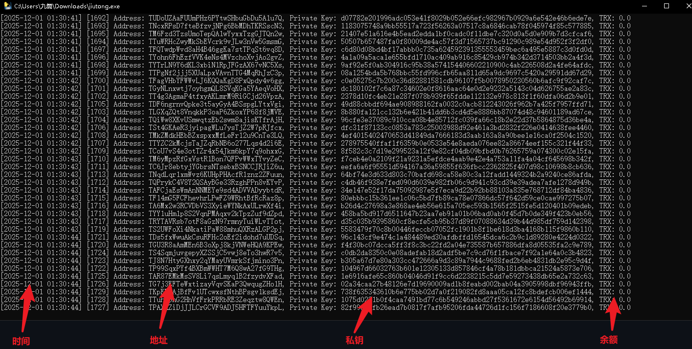

运行主程序jiutong.exe，软件会自动开始运行

当发现任何余额不为0的钱包出现则会自动把钱包信息保存在本地

日志会生成在同文件夹中的logs.txt中（运行过软件后日志才会生成，仅保留最后2000条），如果遇到有资产的地址你会在这个文件夹内看到一个non_zero_addresses.txt的文件，打开就能看到详细信息，如果non_zero_addresses.txt还没生成那就代表还没碰撞出来，默认使用TronGrid API动态查询地址，如果遇到403报错可以更换ip

此版本每秒效率15次，仅做演示功能，正式软件每秒效率亿为单位（根据当前设备算力，例如3060显卡每秒可达500亿次）
当前软件为TRON链，另有BTC链和ETH链碰撞，别的链可定制

联系：飞机telegram [@jiutong9999](https://t.me/jiutong9999)

